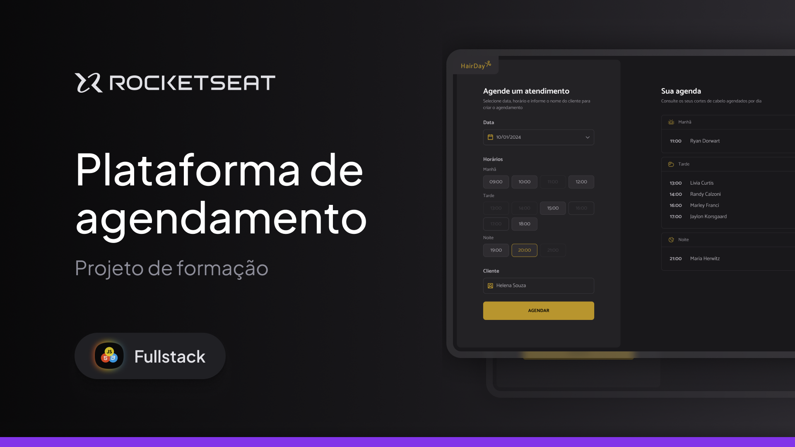

  

<h1 align="center"> Plataforma de Agendamento </h1>

Programa exclusivo no curso Full-Stack, promovido pela Rocketseat para ensino de tecnologias WEB, no Modulo JavaScript, realizado junto com instrutor, Desenvolvendo um projeto um sistema de agendamento de corte de cabelo, com todas as funcionalidades, aplicando todo o conseito Javascrip, Node.js, com API, configuração Babel, Webpack e pacotes.

  <a href="#-tecnologias">Tecnologias</a>&nbsp;&nbsp;&nbsp;|&nbsp;&nbsp;&nbsp;
  <a href="#-Projeto">Projeto</a>&nbsp;&nbsp;&nbsp;|&nbsp;&nbsp;&nbsp;
  <a href="#-layout">Layout</a>&nbsp;&nbsp;&nbsp;

 

  

## 🚀 Tecnologias

Esse projeto foi desenvolvido com as seguintes tecnologias:

- HTML e CSS
- Git e Github
- Figma
- Javascript
- Node.js
- Babel
- Webpack
- Pacotes

## 💻 Projeto

Voce pode visualizar o projeto pronto projeto através [DESSE LINK]()
O Projeto Plataforma de Agendamento é um agregador de ensino na Rocketseat para avançar o conhecimento em JavaScript, Node.js, API, Babel, Webpack e Pacotes.

## 🔖 Layout

Você pode visualizar o layout do projeto através [DESSE LINK](https://www.figma.com/community/file/1360316357733167308). É necessário ter conta no [Figma](https://figma.com) para acessá-lo.

---

Rocketseat: [Participe da nossa comunidade!](https://www.rocketseat.com.br/)
